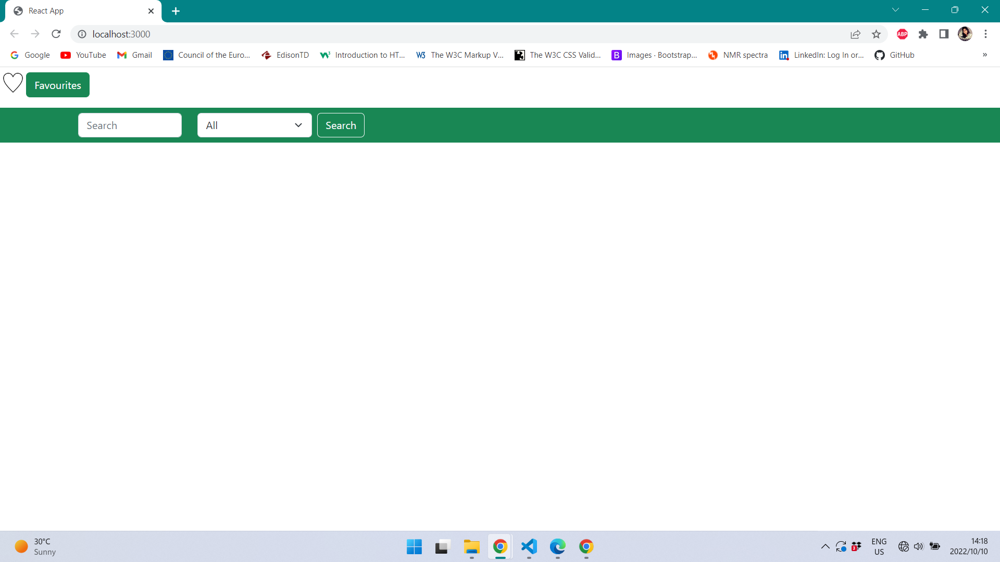
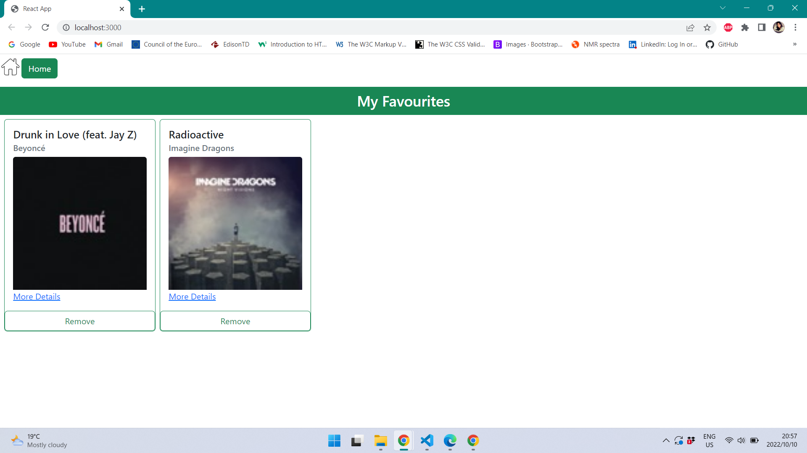
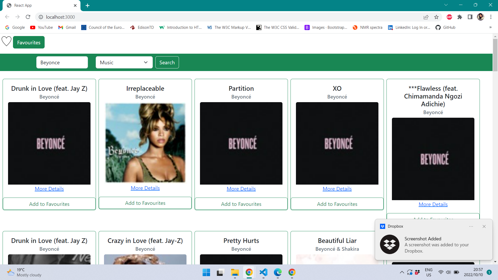
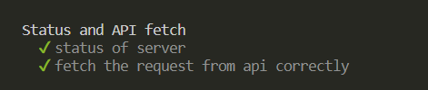

# a. How To Use The App:

1. The home page of the app contains a search bar and a dropdown to select the type of media to search for. Once the search button is clicked
   the search results will be displayed.
   
2. The item will appear with its name, artist name, image, a link to the itunes website and a button to add the item into a favourites list.
3. If the "Add to Favourites" button is clicked the item will be added to the favourites list. The user can then click the "Favourites" button
   on the home page to navigate to the favourites page.
   
4. An item can not be added to favourites if it is already in the favourites list.
5. In the favourites page, the items are displayed with its name, artist name, image, a link to the itunes website and a button to delete the
   item from the favourites list.
6. The "Home" button can be clicked to navigate back to the search bar on the home page.
   
7. The list of favourites will be deleted when the browser is closed.

# b. Installing, Testing and Running App on Local Machine:

## Installing the App:

1. Copy the files to a project folder.
2. Navigate to the "backend" directory of the project.
3. To install the node modules, type "npm install" in the command line.
4. Navigate to the "frontend" directory of the project.
5. To install the node modules, type "npm install" in the command line.

## Testing the Code:

### Testing the Backend (Express App) Code:

1. Navigate to the backend directory of the project.
2. Type "npm install request --save" into the command line to install the request package.
3. Type 'npm install --save-dev mocha chai' into the command-line to install mocha and chai.
4. To run the test type "npm test" into the command line.
5. The screenshot below should appear in the terminal:
   

### Testing thr Frontend (React App) Code:

1. Navigate to the frontend directory of the project.
2. Install the react-test-renderer for rendering snapshots by typing "npm add --dev react-test-renderer" into the command line.
3. To run the tests: Type "npm test" in the command line.
4. The screenshot below should appear in the terminal:
   

## Running the App:

1. Navigate to the "backend" directory of the project.
2. To start the server, type "npm start" in the command line.
3. Navigate to the "frontend" directory of the project.
4. To start the server, type "npm start" in the command line.
5. The app runs on: http://localhost:3000

# c. Measures Taken to Ensure the Security of the App:

1. Helmet was installed to secure the Express app (backend).
2. No API keys were dealt with.

# d. Link to the deployed app

## GitHub

[GitHub Link](https://github.com/ShaySN29/iTunes_app)

## Heroku

[Heroku Link]()
